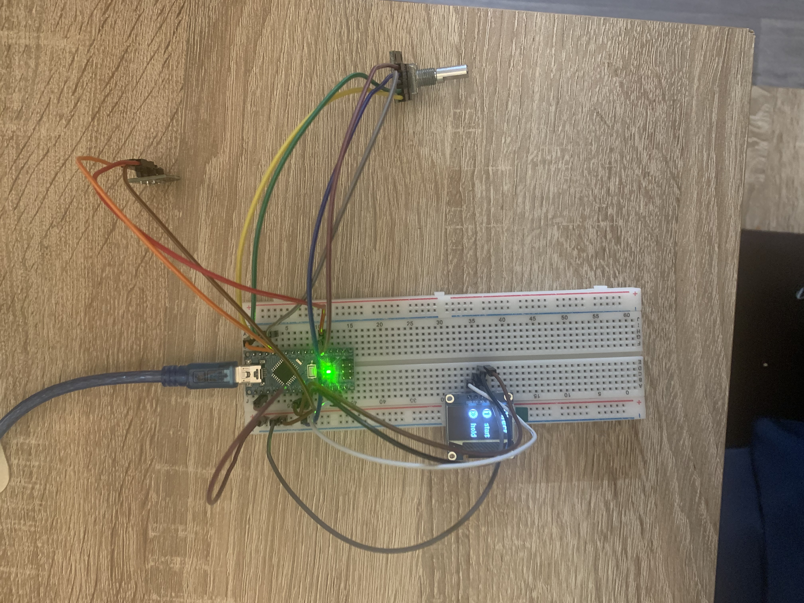
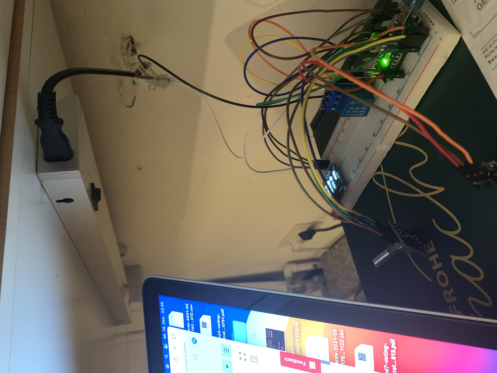

## This describes how to set up the demo without the scale
Instead of the mill we will use the buildin LED from the arduino or a LED.

### Connecting the wires

- (todo) fritzing picture

Arduino
```
D12 -> Taster Signal
D11 -> Rotary Encoder CLK
D10 -> Rotary Encoder DT
D09 -> Rotary Encoder SW
D08 -> Relais Signal
GND -> Taster GND, Rotary Encoder GND, Display GND, Relais
3V3 -> Taster positiv, Rotary Encoder positiv, Display VCC, Relais
A5  -> Display SCL
A4  -> Display SDA

```
Taster
```
Signal -> Arduino D12
GND    -> Arduino GND 
Positv -> Arduino 3V3

```
Rotary encoder
```
CLK     -> Arduino D11
DT      -> Arduino D10
SW      -> Arduino D09
Positiv -> Arduino 3V3
GND     -> Arduino GND

```

Display
```
GND -> Arduino GND 
VCC -> Arduino 3V3
SCL -> Arduino A5
SDA -> Arduino A4

```

Relais
```
Signal  -> Arduino D8
Positiv -> Arduino 3V3
Negativ -> Arduino GND

```

### Building up the set up:


1. the project must be inside an IDE (like described in the [WebEditor](./arduinoWebEditor.md))
2. set up the components on the breadboard
   1. Arduino
   2. Taster
   3. display
   4. rotary encoder
   5. the relais
   6. (todo) maybe the On/Off switch needs to be placed here as well
1. the following lines can be changed to mock the mill. Instead of the mill we will use our LED. So that if the millButton will be pushed, the LED will be turned on until the grind process is done.
   1. in UI.h the line 110
      1. from: 
      ```
      static const unsigned char RELAY_PIN = 7; 
      ```
      3. to: 
      ```
      static const unsigned char RELAY_PIN = LED_BUILTIN;
      ```
   2. in RUN.cpp line 7
      1. from: 
      ```
      digitalWrite(UI::RELAY_PIN, HIGH);
      ```
      3. to: 
      ```
      digitalWrite(UI::RELAY_PIN, LOW);
      ```
   3. in RUN.cpp line 39
      1. from: 
      ```
      void Run::startMill() { digitalWrite(UI::RELAY_PIN, LOW); }
      ```
      3. to: 
      ```
      void Run::startMill() { digitalWrite(UI::RELAY_PIN, HIGH); } 
      ```
   4. in RUN.cpp line 41
      1. from: 
      ```
      void Run::stopMill() { digitalWrite(UI::RELAY_PIN, HIGH); }
      ```
      3. to: 
      ```
      void Run::stopMill() { digitalWrite(UI::RELAY_PIN, LOW); } 
      ```
3. deploy everything on the arduino
4. now you can get some experience with the display and the buttons
5. the first running demo looks like this<br>
6. <br>
7. Next we will insert the relais into the breadbord. Therefore you will need to change some lines again:
   1. in UI.h replace the line 110
      1. from: 
      ```
      static const unsigned char RELAY_PIN = LED_BUILTIN;
      ```
      3. to: 
      ```
         static const unsigned char RELAY_PIN = 8;
         static const unsigned char RELAY_PIN_LED = LED_BUILTIN;
      ```
1. with the relais it looks like this<br>
<br>
1. the last step would be to hock up something on the relais. E.g. a lamp or something with an external powersupply. So that we can test if the relais and the programm works as designed.
   1. I connected the kitchen lamp. Doesn't looks so save but works and it does the job
   2. <br>

## Todo: add a demo with scale
