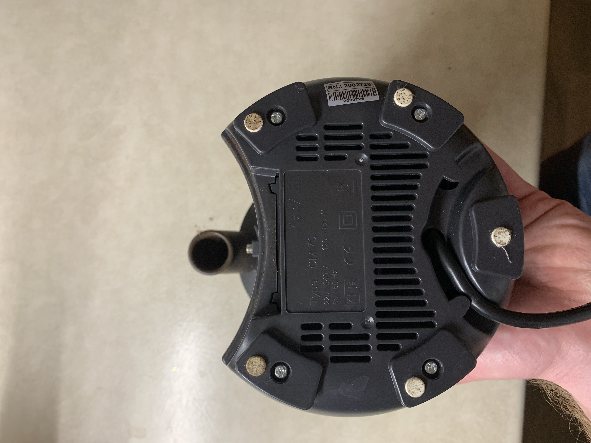
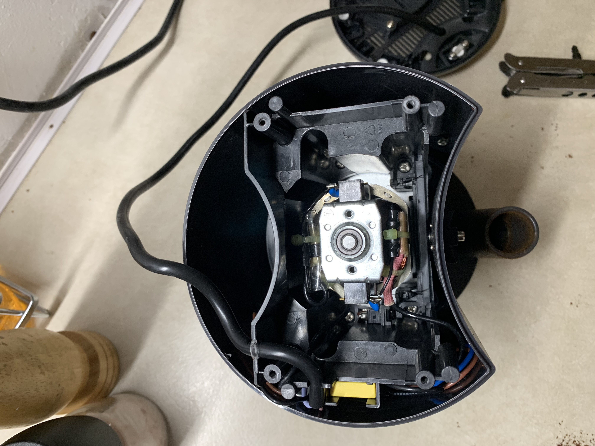
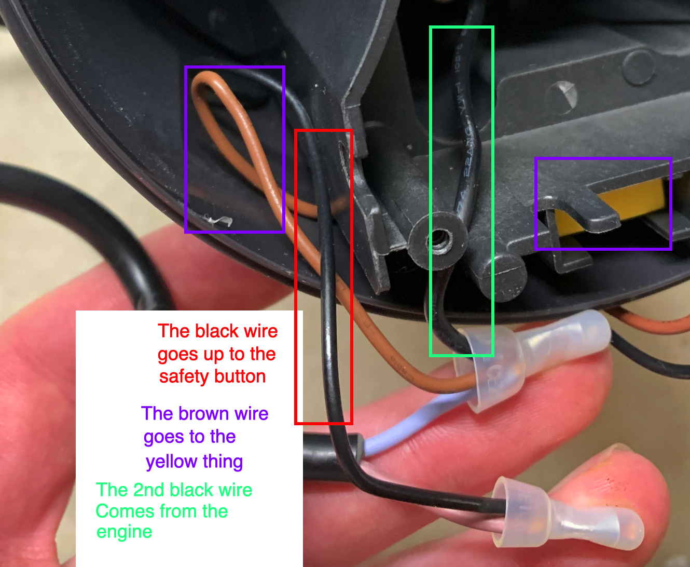
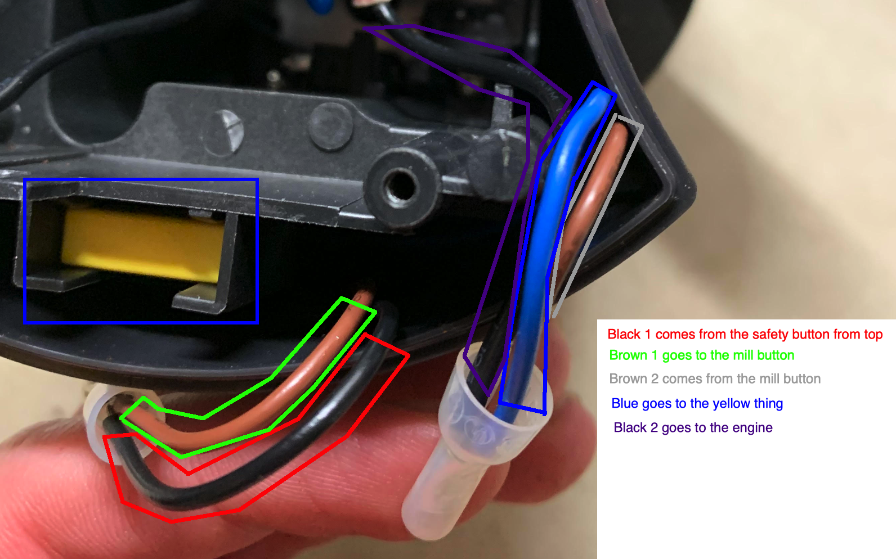

This will describe how you do the real setup to a mill. On your own risk. On your own mill.
It might be different between different mills.

## This is an example for the CM70

1. You will need to setup everything on the breadboard like it is described in the demo setup. We will connect it to the mill first, to see if everything works. After that we will care about making it nice and sexy
2. (todo: is this step needed?)if you have done the demo setup you need to change back the changed lines. Or just import the project to the IDE again and deploy it to the arduino.
3. disconnect the mill from the power
4. remove the lose parts
5. (optional) clean everything up ;)
6. open up the mill from the bottom
   1. 
   2. 
7. pull out the wires. They are nicely pushed into the space of the mill
   1. 
   2. 
   3. 
8. I have put each wires from the relais in one of the ruber things from the last picture. It was quite hard and took some time
   1. Todo: insert picture
1. After that put the mill back together so that all the safty conectors/buttons are back in place
2. Power up the arduino and the mill
3. push the millButton on the arduino
4. It works!!!!

## How can we make it nice?

17.12.2021: Work in progress
