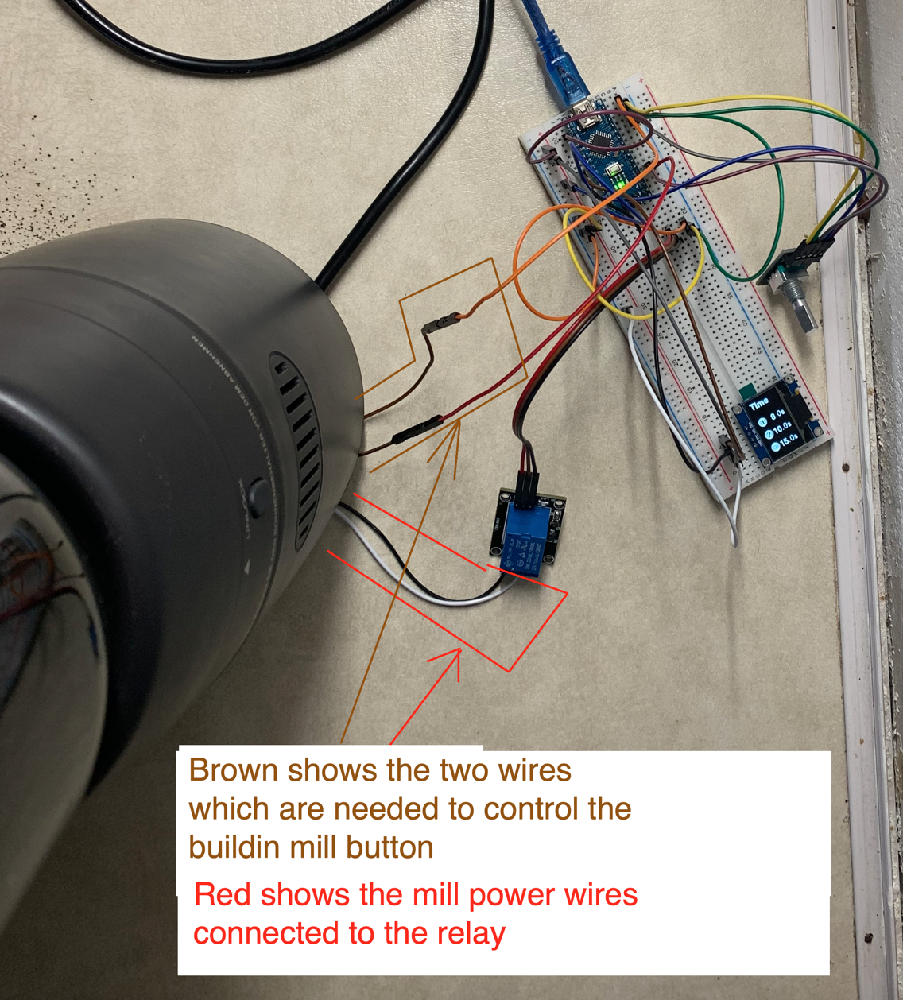
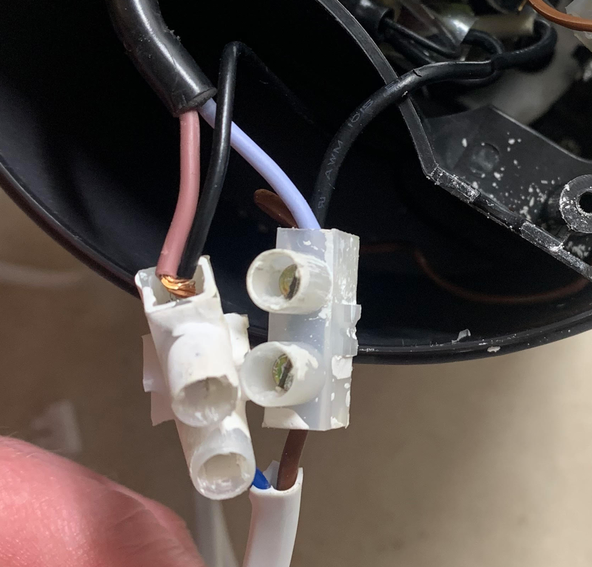
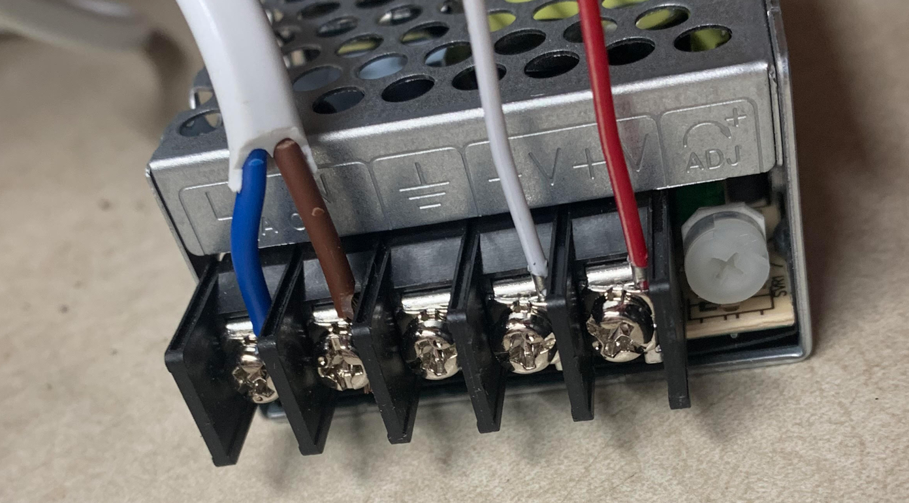
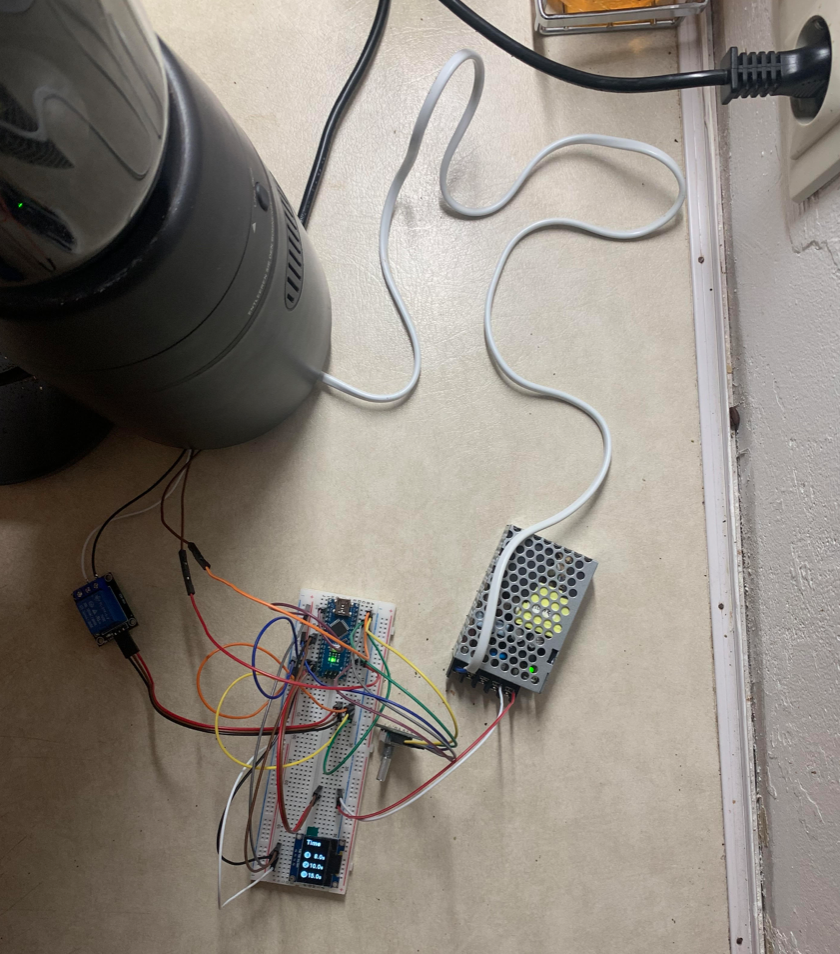

Back to the [main page](../README.md)

On this page I will describe how you can do the real setup to a mill. On your own risk. On your own mill.
It might be different between different mills.

## This is an example for the CM70

1. You will need to setup everything on the breadboard like it is described in the demo setup. We will connect the setup to the mill first and test if everything works. After that we will care about making it nice and sexy.
2. (todo: is this step needed?)if you have done the demo setup you need to change back the changed lines. Or just import the project to the IDE again and deploy it to the arduino.
3. disconnect the mill from the power
4. remove the lose parts
5. (optional) clean everything up ;)
6. open up the mill from the bottom
   1. 
   2. 
7. pull out the wires. They are nicely pushed into the space of the mill
   1. 
   2. 
   3. 
8. I have put each wires from the relais in one of the ruber things from the last picture. It was quite hard and took some time
   1. you can also use other cable connectores. Important is that everything is save connected and no blank wires are laying around.
1. After that put the mill back together so that all the safty conectors/buttons are back in place
2. Power up the arduino and the mill
3. push the millButton on the arduino
4. It works!!!!
5. a short clip can be found here: https://github.com/Steffeeeen1234/MillControl/blob/master/subPages/pictures/IMG_7164.MP4

### How can we make the setup for the CM70 nice?

First thing which annoyed me, after grinding a few coffees was that the external taster/mill button on the arduino needed to be pushed instead of the build in MillButton.

Second thing which annoyed me was, that the arduino needed its own power supply. I think it is much more handy if it is connected to the mills voltage circut.

Thrid thing was, how to make the setup so small that it fits into a box. If you use smaller party (e.g. for the power Supply or the relais) and if you have enough room in the mill, you can also put everything inside it. I didn't managed and I am fine with the small box.

#### Using the built in MillButton

1. open up the mill again
3. find the wires which control the buildin mill button. In my case those are the brown once.
4. disconnect the wires from the mill voltage circut
5. connect those two wires to the arduino instead of the taster which we have installed in the demo project 
   1. one wires goes to pin 12
   2. the other wire goes to GND
   3. there is one wire left over which comes from the arduino. It was for the signal and is not needed anymore.
6. you will need to find a way how to store all the cables and cable connectors in the mill but it will work.
7. put everything back together
8. now you have two wires going out and two wires going into the mill
   1. 

#### Connecting the Arduino to the voltage curcuit from the mill
1. To change that I have ordered the "mean well RS 15 5" a 220v to 5v power supply (see hardware page [here](../HardwareRequirements.md)).
1. unplug the mill and the arduino from the power
2. open up the mill again
3. locate the incoming power wire.
1. I have removed the rubber things and installed those two white things (luster terminal). And now you can easily connect a cable which will go to the power supply. I guess you can use any kind of cable. But be carefull because there will be a lot of power going through those wires later.
   1. 
1. On the power Supply you connect those two cable coming from the mill to L and N. 
   1. 
3. you connect two wires which will go to the arduino at "-V" and "+V" 
4. on the arduino you connect "+V" to VIN and "-V" to GND
5. put the mill back together
6. now you don't need to connect a 2nd power cable to the arduino anymore
   1. 

#### Fit everything in a box (29.12.2021: Work in progress)
For now I havent found a good 3D printed version for a box so that everything fits. 
The best I found is this wire box. I found it at the local hardware store.

1. To put everything inside the box, we need to find out were to place which part (in progress)
2. Cut the wires short, connect all GND wires to one Arduino wire (in progress) 
3. put everything together in the box

